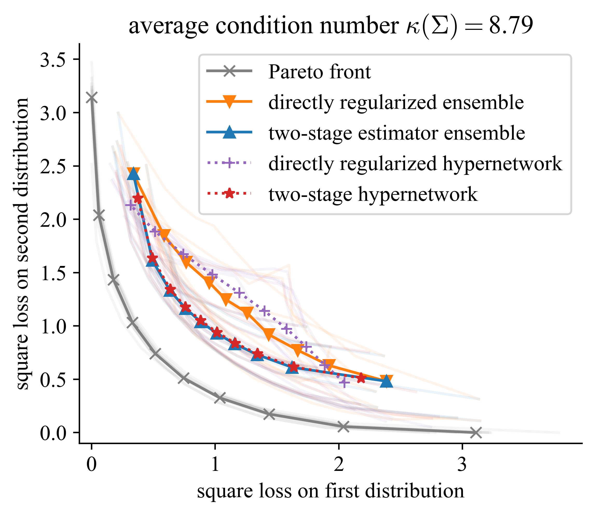

# Learning Pareto manifolds in high dimensions: How can regularization help?

[](TODO)
[](https://python.org/downloads/release/python-3118/)
[](https://pytorch.org/)
[](LICENSE)


* [Overview](#overview)
* [Installation](#installation)
* [Usage](#usage)
* [Contact](#contact)
* [Citation](#citation)


## Overview
<p align="center">

</p>
This repository contains the Python implementation of the experiments in "Learning Pareto manifolds in high dimensions: How can regularization help?". It investigates two methods for regularization in multi-objective learning, using sparsity penalties and unlabeled data; direct regularization and a two-stage approach. It implements these regularization methods for ensembles of models as well as hypernetworks. Specifically, the implemented methods are

- directly regularized ensembles (```ensembles.py```)
- two-stage regularized ensembles (```ensembles.py```)
- directly regularized hypernetworks (```hypernetworks.py```)
- two-stage regularized hypernetworks (```hypernetworks.py```)

## Installation

1. Clone the git repository to your local machine using
    ```bash
    git clone https://gitlab.inf.ethz.ch/OU-YANG/fairness_lower_bounds.git
    ```
2. Create a new virtual environment using
    ```python3 -m venv myvenv```
    and activate the venv using
    ```source myvenv/bin/activate```.
2. Install required packages in your virtual environment using
    ```bash
    pip3 install -r requirements.txt
    ```
    or individually. The required dependencies are:
    - matplotlib 3.8.4
    - numpy 2.2.1
    - pandas 2.2.3
    - ray 2.40.0
    - scikit_learn 1.6.0
    - scipy 1.15.0
    - torch 2.5.1
    - tqdm 4.67.1

## Usage

_The easiest usage is through the Jupyter notebook_ ```main.ipynb```. 

The experimental parameters, also for the individual scripts, are described in more detail in the notebook. 

There are three main experiments implemented, corresponding to the three experiments presented in the paper:

### 1. Multiple Sparse Linear Regression

The experiments are implemented in ```multiple_regression.py```.

#### 1.1 The effect of sparsity and number of unlabeled data on ensembles

The first experiment on sparse multiple linear regression. This experiment is entirely run on synthetic data. 

The experiment can be run using
```bash
python3 multiple_regression.py --exp "sparsity-unlabeled" --output "errors/"
```

#### 1.2 Pareto fronts of ensembles and hypernetworks
The second experiment on sparse multiple linear regression compares four methods from the paper. We plot the resulting Pareto fronts.

The experiment can be run using

```bash
python3 multiple_regression.py --exp "pareto-fronts" --output "errors/"
```


### 2. Fairness datasets

We compare the a directly regularized ensemble with a two-stage ensemble applied to real fairness datasets. The experiment is implemented in ```fairness.py```. The datasets are:

1. The [Communities and Crimes dataset](https://archive.ics.uci.edu/dataset/183/communities+and+crime) from the UC Irvine Machine Learning Repository,
2. the [Adult dataset](https://archive.ics.uci.edu/dataset/2/adult) from the UC Irvine Machine Learning Repository,
3. the [HSLS dataset](https://nces.ed.gov/surveys/hsls09/) from the High School Longitudinal Study 2009 and
4. the [ENEM dataset](https://drive.google.com/file/d/14s_P1pNy4SPKoaTAtIqALngNeoPUChZ4/view?usp=share_link) preprocessed for fair classification [here](https://github.com/HsiangHsu/Fair-Projection).

The see ```preprocessing.py``` for the preprocessing. View the label distributions

```bash
python3 preprocessing.py
```

The fairness experiment can be run using
```bash
python3 fairness.py --output "errors/" --datasets "communities" "adult" "hsls" "enem" --num_experiments 2
```
where the arguments are:
- ```--output```: specifies the folder the errors will be saved to.
- ```--datasets```: specifies a list of which datasets to use. Can be any combination of ```"communities"```, ```"adult"```, ```"hsls"``` and ```"enem"```.
- ```--num_experiments```: specifies the number repetitions of the experiments (defaults to 20).

### Plotting the results

To plot the results from any of the three experiments, use
```bash
python3 plotting.py --plot "sparsity-unlabeled" --errors "errors/<path-to-error-file>"
```
where the arguments are:
- ```--plot```: determines which experiment to plot. Can be any of ```"sparsity-unlabeled"```, ```pareto-fronts``` and ```fairness```.
- ```--errors```: specifies which error file to plot. Change ```errors/<path-to-error-file>``` to the error file of the experiment you'd like to plot, e.g., ```errors/fairness2025-01-04-17:58:31```.

## Contact

For any inquiries, reach out to [twegel@ethz.ch](mailto:twegel@ethz.ch).